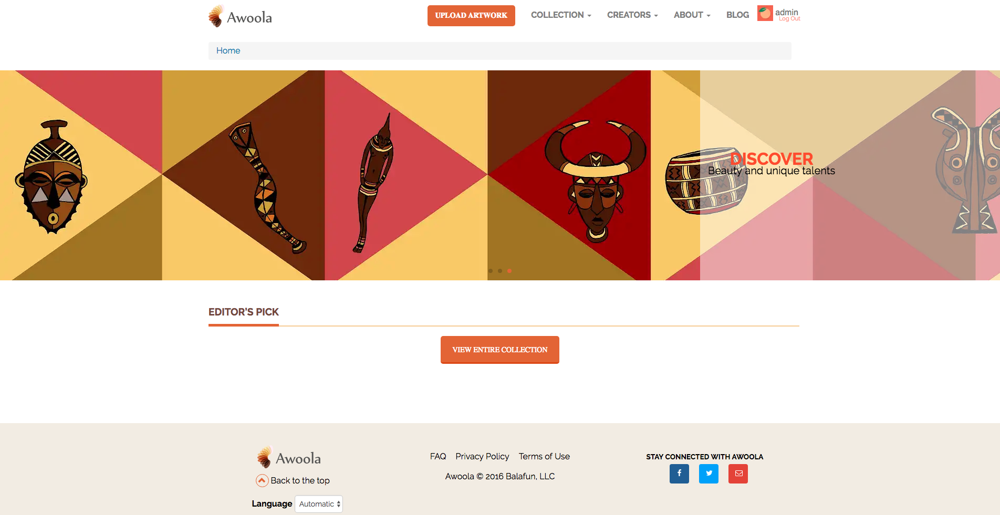

## Overview

Awoola was a photo sharing application targetted towards artists. Completed as freelance work. 

## Tech Stack

* Meteor
* BlazeJS
* MongoDB
* Bootstrap
* Cloudinary, for Image hosting and transformations
* DigitalOcean, for application hosting
* Compose, for MongoDB hosting

## Media

Home Page