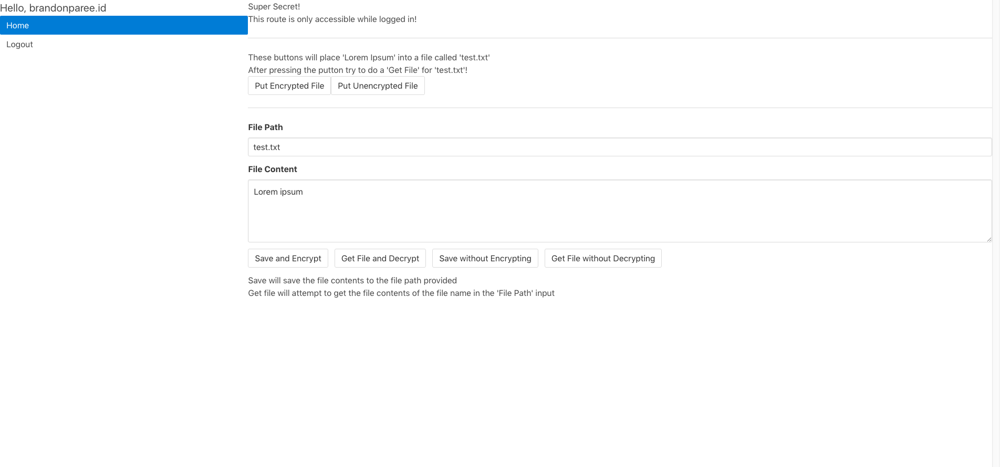
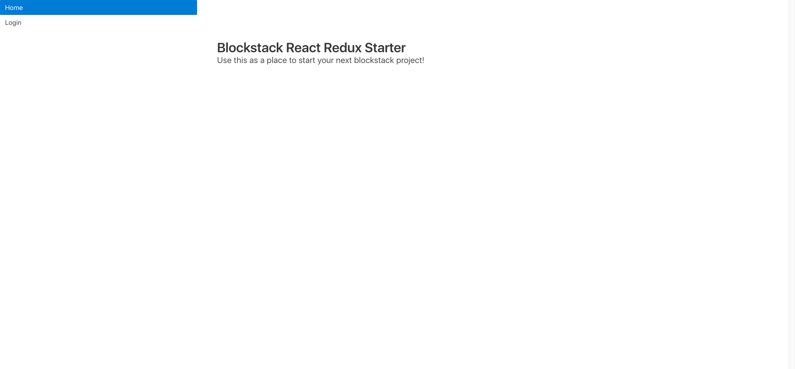

## Overview

A starter kit for building applications with Blockstack using React and Redux. The project can be found on Github [here](https://github.com/brandonparee/blockstack-react-redux-starter). Includes an example for authentication as well as saving and retrieving files with Blockstack. 

## Tech Stack

* Blockstack
* React
  * react-router
* Redux
* Bulma, with additional styles written in Sass

## Media

*You can choose to place file into storage encrypted or unencrypted.*

*An example of the text file retrieved, but not decrypted.*

*Home Page*