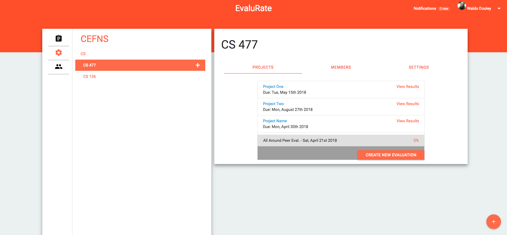
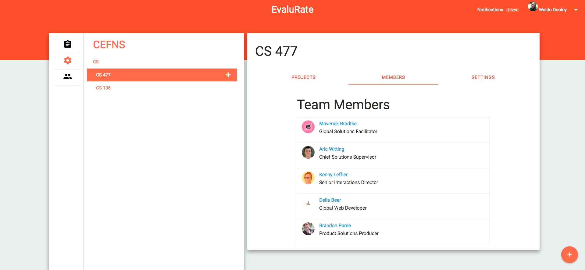
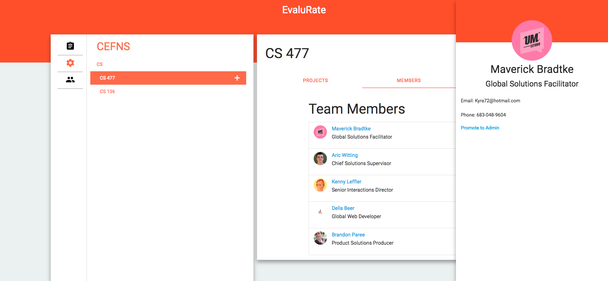
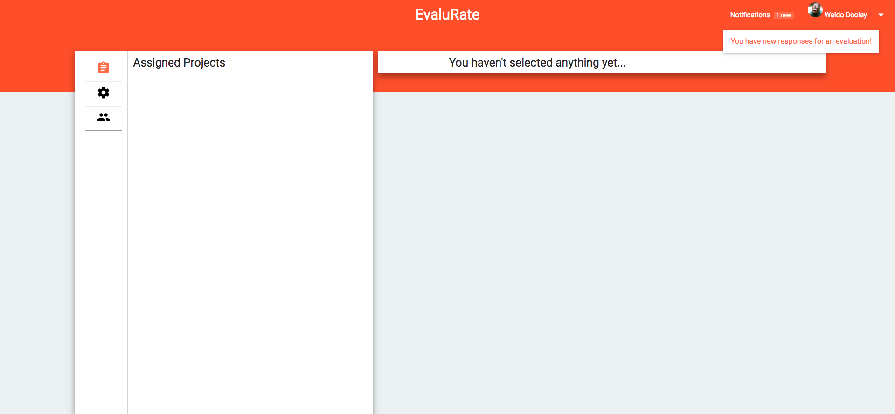
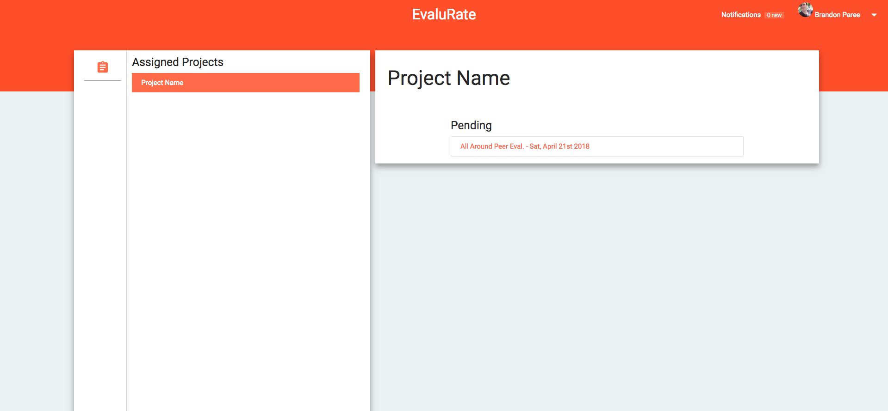
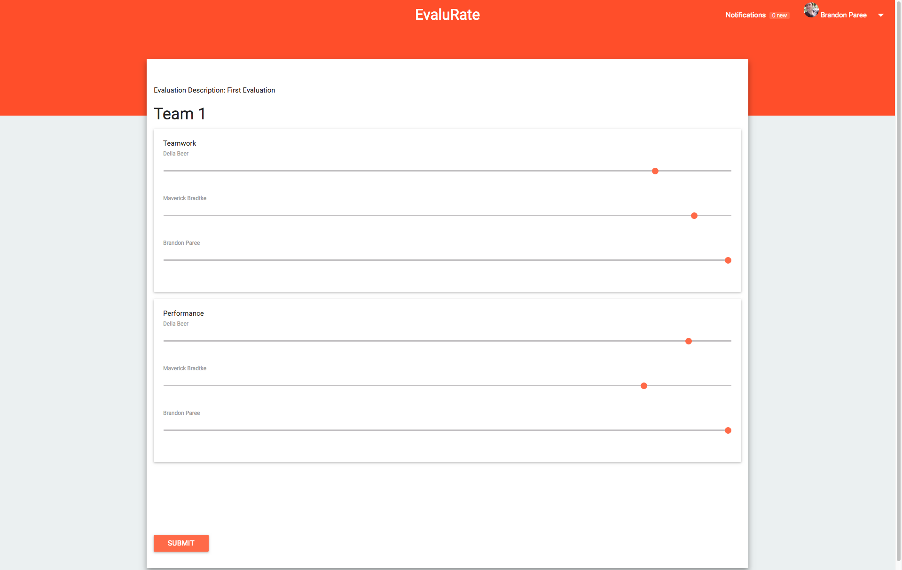
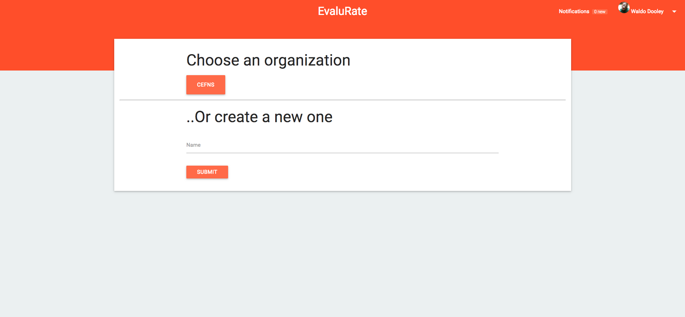
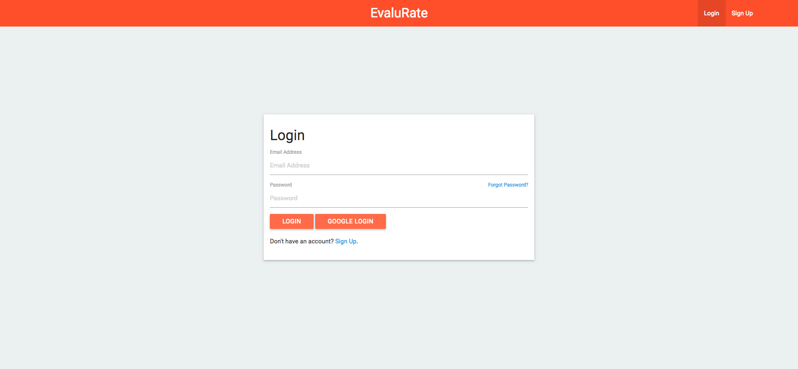

## Overview

Evalurate is an easy way for teams to perform peer evaluations. Evalurate was my Capstone Project completed at Northern Arizona University with my team -- [Dylan Grayson](https://www.linkedin.com/in/dylangrayson), [Conner Swann](https://www.linkedin.com/in/connerswann), and [Brian Saganey](https://www.linkedin.com/in/brian-saganey-8115b6110). Additional information including design documents can be found [here](https://www.cefns.nau.edu/capstone/projects/CS/2016/Hackjacks/).

Role: Full Stack Developer + Designer

## Tech Stack

* Meteor
* BlazeJS
* MongoDB
* Bootstrap, with additional styles written in Sass 
* DigitalOcean, for application hosting
* mLab, for MongoDB hosting

## Media

*Admins can create projects and assign evaluations in any 'unit'. A unit can be any 'organization' (e.g. CEFNS) or child below it (e.g. CS 477).*

*Admins can view all members in a unit and add more.*

*Admins can view information about any member in their organization in the profile view.*

*Admins recieve notifications when evaluations are completed.*

*Regular users can view which projects they are in and what evaluations they must complete.*

*Regular users complete evaluations created by admins.*

*Users can be included in multiple organizations, during sign in, they choose which one to view.*

*Sign in Page*