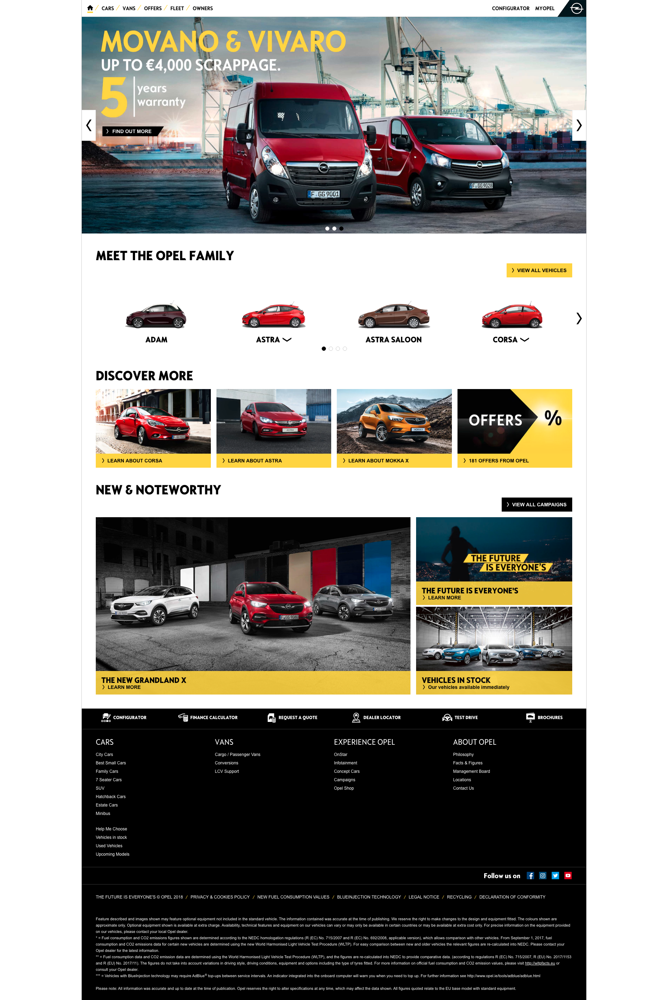

## Overview

While working at General Motors, I was a member of the team that built Opel's new website. Opel was the first website to debut the company's new way of building websites on top of Adobe Experience Manager. I can be found in the [humans.txt](https://www.opel.ie/humans.txt) along with a bunch of other awesome people!

Role: Front End Developer (jQuery/Sass)

## Tech Stack

* jQuery
* Foundation, with additional styles written in Sass
* Adobe Experience Manager

## Media

Home Page

Model Overview Page
