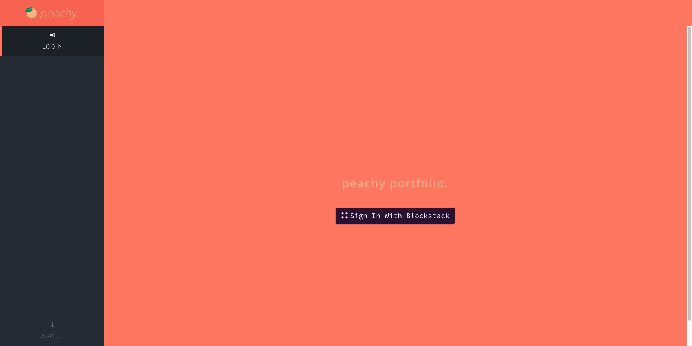

## Overview

Peachy Portfolio is a cryptocurrency portfolio tracking web application built with React and Blockstack. Peachy Portfolio was a submission for Blockstack's Signature Bounties: Encrypted Token Portfolio App competition. It is available to use at [peachyportfolio.com](https://peachyportfolio.com), the source code is also available on Github [here](https://github.com/brandonparee/blockstack-token-portfolio).

## Tech Stack

* Blockstack
* React
    * react-router
* Redux
* Bulma, with additional styles written in Sass
* Docker
* DigitalOcean
* Drone 

## Media

*Portfolio Overview*

*Adding a Transaction*

*Overview for single cryptocurrency in portfolio*

*Market Data*

*Market data for a single cryptocurrency*

*Sign In Page*
