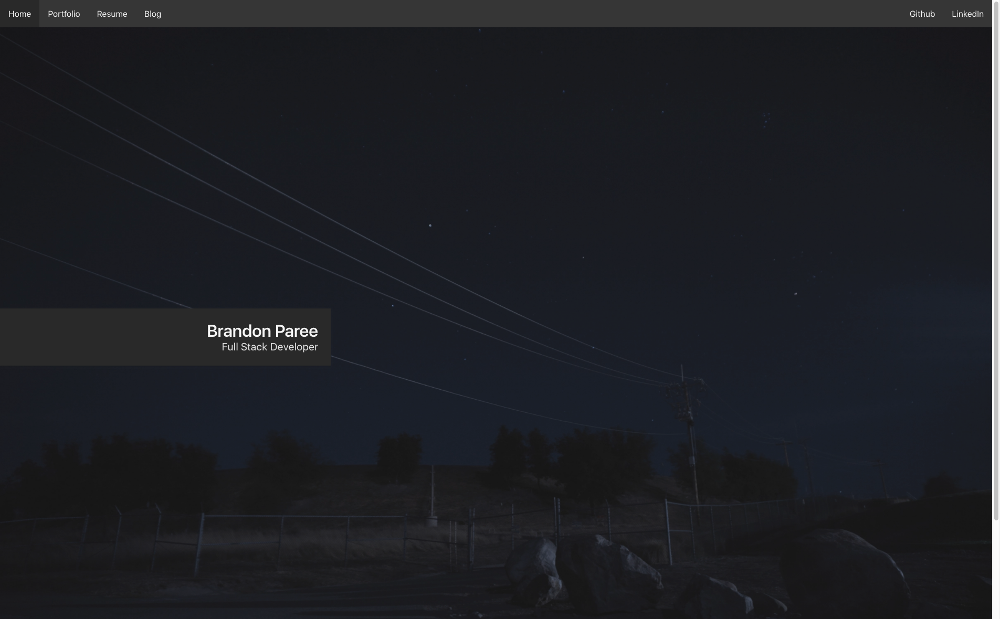

My personal website was creating using GatsbyJS, which is a way to generate static websites using React and GraphQL.

### Tech Stack

* GatsbyJS
* React
* GraphQL
* Bulma, with additional styles written in Sass

### Media

*Home Page*